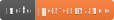
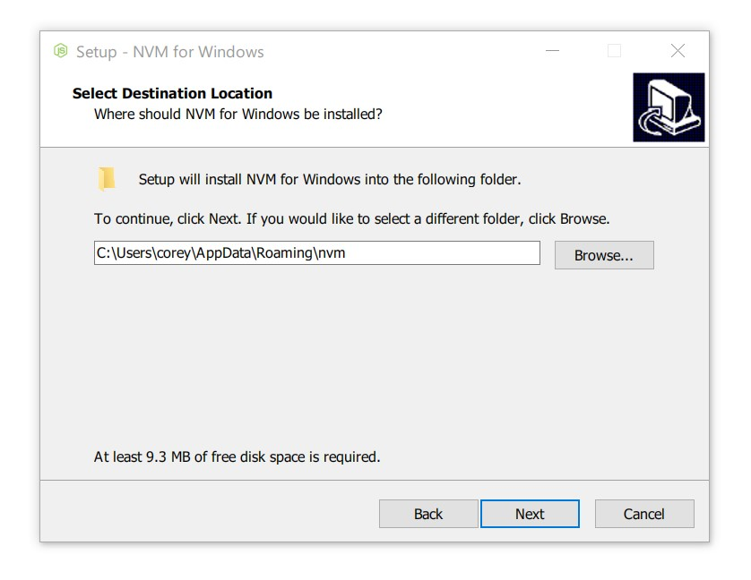
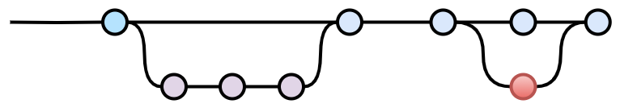
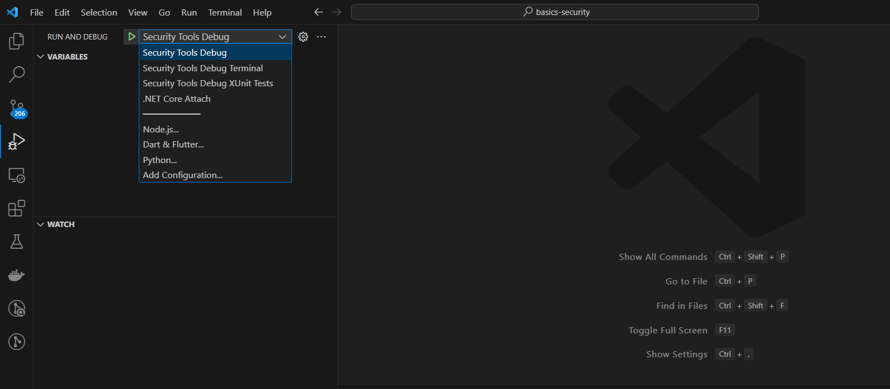

# Development

This is the documentation for developers which describes how to build, test and release the application.
# Table of Contents

* [Documentation](#documentation)
* [Build Environment](#build-environment)
  * [Git](#git)
  * [Docker](#docker)
    * [Debian](#debian)
  * [.Net SDK](#net-sdk)
    * [Debian](#debian-1)
  * [Node.js and npm](#nodejs-and-npm)
    * [Debian](#debian-2)
    * [Windows](#windows)
  * [Angular](#angular)
  * [Google Chrome](#google-chrome)
  * [IDE](#ide)
    * [Visual Studio Code](#visual-studio-code)
* [Minor Update of Build Environment](#minor-update-of-build-environment)
  * [.Net SDK](#net-sdk-1)
    * [Dependencies](#dependencies)
  * [Nodejs and NPM](#nodejs-and-npm-1)
    * [Docker](#docker-1)
  * [ClientApp](#clientapp)
* [Major Update Build Environment](#major-update-build-environment)
  * [.Net SDK](#net-sdk-2)
    * [Docker](#docker-2)
    * [Dependencies](#dependencies-1)
  * [Nodejs and NPM](#nodejs-and-npm-2)
    * [Docker](#docker-3)
  * [ClientApp](#clientapp-1)
* [Branching Strategy](#branching-strategy)
* [Project Setup](#project-setup)
* [Build Project](#build-project)
  * [Shell Script](#shell-script)
  * [Build Docker Container](#build-docker-container)
    * [Container Ports](#container-ports)
    * [Dangling Images](#dangling-images)
* [Debug](#debug)
  * [Visual Studio Code](#visual-studio-code-1)
* [Testing](#testing)
* [Guidelines](#guidelines)
* [Release Process](#release-process)
  * [Create Release Branch](#create-release-branch)
  * [Update App Version](#update-app-version)
  * [Update NPM Dependencies](#update-npm-dependencies)
    * [Find outdated Packages](#find-outdated-packages)
    * [Upgrade NPM](#upgrade-npm)
    * [Upgrade Packages](#upgrade-packages)
    * [Update packages](#update-packages)
    * [Find Vulnerabilities](#find-vulnerabilities)
  * [Upgrade .Net SDK](#upgrade-net-sdk)
  * [Upgrade .Net Dependencies](#upgrade-net-dependencies)
  * [Update Changelog](#update-changelog)
  * [Build Release](#build-release)
  * [Create Tag](#create-tag)

# Documentation

The complete documentation of this project is written in text files using the markdown syntax.

[diagrams.net](https://www.diagrams.net/) is used to draw diagrams. There is also an unofficial extension named [Draw.io Integration by Henning Dieterichs](https://marketplace.visualstudio.com/items?itemName=hediet.vscode-drawio) for Visual Studio Code.

You can use created badges by [shields.io](https://shields.io/):

# Build Environment

The backend is based on [ASP.NET](https://dotnet.microsoft.com/en-us/apps/aspnet). The decision for .NET as the backend technology has been made because

- the performance provided by C++ is not required, 
- it allows an easy integration with modern web technologies like Angular,
- it allows to develop apps that run on all common platforms available today, including Linux, iOS, Android (via Xamarin) and Windows 7/8/8.1/10/11 (including embedded/IoT editions) without requiring platform-specific modifications.

The frontend is developed with [Angular](https://angular.io/). If you are not familiar with Angular, visit [Angular Training](https://angular-training-guide.rangle.io/). The decision for Angular as the frontend technology has been made because 

- it has a big community, 
- the community is still working on features and bug fixes
- it allows a fast as well as a structured implementation of single page applications.

## Git

&nbsp; &nbsp;

The project source code is available on [GitLab](https://gitlab.com/GGolbik/basics-security).

Install [git](https://git-scm.com/downloads) and execute:

~~~
git clone https://gitlab.com/GGolbik/basics-security.git
~~~

or clone with SSH:

~~~
git clone git@gitlab.com:GGolbik/basics-security.git
~~~

## Docker

Docker is required to build the Docker images of the application. You can also just install docker and use the `build-docker.sh` script ot build the application. In this case you don't have to setup the full development environment.

Tip - Removing dangling images:

~~~
docker rmi $(docker images --filter "dangling=true" -q --no-trunc)
~~~

### Debian

[Install Docker Engine on Debian](https://docs.docker.com/engine/install/debian/)

Install using the convenience script (Docker provides a convenience script at get.docker.com to install Docker into development environments quickly and non-interactively.).

~~~
curl -fsSL https://get.docker.com -o get-docker.sh
sudo sh get-docker.sh
~~~

## .Net SDK

The project is an `ASP.NET` web API project which requires the `.NET SDK`.

Install the [.NET SDK](https://dotnet.microsoft.com/en-us/download) (`7.0`).

### Debian

Add the Microsoft package signing key to your list of trusted keys and add the package repository.

~~~
wget https://packages.microsoft.com/config/debian/11/packages-microsoft-prod.deb -O packages-microsoft-prod.deb
~~~

~~~
sudo dpkg -i packages-microsoft-prod.deb
~~~

~~~
rm packages-microsoft-prod.deb
~~~

The .NET SDK allows you to develop apps with .NET. If you install the .NET SDK, you don't need to install the corresponding runtime. To install the .NET SDK, run the following commands:

~~~
sudo apt-get update && \
sudo apt-get install -y dotnet-sdk-7.0
~~~

Test installation:

~~~
dotnet --version
7.0.403
~~~

Upgrade .Net SDK

~~~
sudo apt update
sudo apt list --upgradable
sudo apt --only-upgrade install dotnet-sdk-7.0
~~~

## Node.js and npm

&nbsp; &nbsp;

The client is an `Angular` project which requires `Node.js` and `npm`.

Install [Node.js and npm](https://docs.npmjs.com/downloading-and-installing-node-js-and-npm).

### Debian

> Node Version Manager (NVM) is a versatile tool that allows you to install and manage multiple versions of Node.js on your system. It simplifies the process of switching between different Node.js versions, making it easier to work with various projects that require specific Node.js versions.
~~~
sudo apt install curl 
curl https://raw.githubusercontent.com/creationix/nvm/master/install.sh | bash
~~~

The nvm installer script creates an environment entry to the login script of the current user. You can either log out and log in again to load the environment or execute the below command to do the same.
~~~
source ~/.bashrc
~~~

The nvm installation is successfully completed.

Install Nodejs and NPM:
~~~
nvm install --lts
~~~

If you have multiple Node versions installed, you can run ls to get a list of them:
~~~
nvm ls
~~~

### Windows

Use [nvm-windows installer (nvm-setup.exe)](https://github.com/coreybutler/nvm-windows/releases) to install Nodejs and NPM, so download and install it.

> Node Version Manager (NVM) is a versatile tool that allows you to install and manage multiple versions of Node.js on your system. It simplifies the process of switching between different Node.js versions, making it easier to work with various projects that require specific Node.js versions.

Once installed, open the terminal and type the below command, to show a list of node.js versions available for download:

~~~
nvm list available
~~~

Download and install node.js v18.7.0

~~~
nvm install 18.7.0
~~~

Ensure that Node.js is properly installed by typing:

~~~
node --version
v18.7.0
~~~

Test npm installation:

~~~
npm --version
8.15.0
~~~

## Angular

The Angular CLI can be installed globally to execute Angular commands.

Once you have Node.js and NPM installed, as shown above, you can install Angular CLI using the npm package manager as follows (the `-g` flag means to install the tool system-wide to be used by all system users).

~~~
npm install -g @angular/cli
~~~

You can launch the Angular CLI using the `ng` executable which should now be installed on your system. Run the following command to check the version of Angular CLI installed.

~~~
ng version
~~~

## Google Chrome

The Google Chrome browser is used to debug the frontend.

Visit the [Google Chrome Homepage](https://www.google.com/intl/en-us/chrome/) for the installation instructions.

## IDE

This project uses Visual Studio Code as the main IDE.

### Visual Studio Code

Recommended extensions:

- [C#](https://marketplace.visualstudio.com/items?itemName=ms-dotnettools.csharp)
  - Enable `OrganizeImports` parameter of the C# extension.
- [Angular Language Service](https://marketplace.visualstudio.com/items?itemName=Angular.ng-template)
- [GitLens - Git supercharged](https://marketplace.visualstudio.com/items?itemName=eamodio.gitlens)
- [.NET Core Test Explorer](https://marketplace.visualstudio.com/items?itemName=formulahendry.dotnet-test-explorer)
  - Set the `Test Project Path` settings parameter to `**/*Test.csproj`.
  - You may also want to disable the `Add Problems` settings parameter.
- [Draw.io Integration](https://marketplace.visualstudio.com/items?itemName=hediet.vscode-drawio)
- [Docker](https://marketplace.visualstudio.com/items?itemName=ms-azuretools.vscode-docker)
- [shell-format](https://marketplace.visualstudio.com/items?itemName=foxundermoon.shell-format)

# Minor Update of Build Environment

## .Net SDK

Update .Net SDK
~~~
sudo apt update
sudo apt list --upgradable
sudo apt --only-upgrade install dotnet-sdk-8.0
~~~

> Read also [I need a version of .NET that isn't provided by my Linux distribution](https://learn.microsoft.com/en-us/dotnet/core/install/linux-package-mixup?pivots=os-linux-ubuntu#i-need-a-version-of-net-that-isnt-provided-by-my-linux-distribution)

### Dependencies

> In case of a patch it's recommended to update the version in the `src/SecurityTools.csproj` manually.

## Nodejs and NPM

Install Nodejs and NPM:
~~~
nvm install --lts
~~~

If you have multiple Node versions installed, you can run ls to get a list of them:
~~~
nvm ls
~~~

Switch versions with
~~~
nvm use 20
~~~

### Docker

Update the version inside `docker-securitytools-build/Dockerfile`

~~~
RUN /bin/bash -c set -o pipefail \
  && curl -fsSL https://deb.nodesource.com/setup_20.x | bash - \
  && apt-get update \
  && apt-get install -y \
  nodejs
~~~

## ClientApp

Remove `src/ClientApp/package.json` and rebuild.

~~~
npm update
~~~

# Major Update Build Environment

## .Net SDK

Show installed .NET versions:
~~~
dotnet --list-sdks
7.0.405 [/usr/share/dotnet/sdk]
~~~

~~~
dotnet --list-runtimes
Microsoft.AspNetCore.App 7.0.15 [/usr/share/dotnet/shared/Microsoft.AspNetCore.App]
Microsoft.NETCore.App 7.0.15 [/usr/share/dotnet/shared/Microsoft.NETCore.App]
~~~

Install new version
~~~
sudo apt install dotnet-sdk-8.0
~~~

Uninstall old version
~~~
sudo apt remove dotnet-runtime-7.0
~~~

### Docker

Update the version inside `docker-securitytools/Dockerfile`
~~~
# Use ASP.NET Core Runtime as release container - https://hub.docker.com/_/microsoft-dotnet-aspnet
FROM mcr.microsoft.com/dotnet/aspnet:8.0 AS release
~~~

and inside `docker-securitytools-build/Dockerfile`

~~~
# Use dotnet as build container
FROM mcr.microsoft.com/dotnet/sdk:8.0
~~~

### Dependencies

Install [dotnet-outdated](https://github.com/dotnet-outdated/dotnet-outdated)

~~~
dotnet tool install --global dotnet-outdated-tool
~~~

Check for outdated packages

~~~
dotnet-outdated
~~~

> In case of a patch it's recommended to update the version in the `src/SecurityTools.csproj` manually.

Otherwise upgrade packages

~~~
dotnet-outdated -u
~~~

## Nodejs and NPM

Install Nodejs and NPM:
~~~
nvm install --lts
~~~

If you have multiple Node versions installed, you can run ls to get a list of them:
~~~
nvm ls
~~~

Switch versions with
~~~
nvm use 20
~~~

### Docker

Update the version inside `docker-securitytools-build/Dockerfile`

~~~
RUN /bin/bash -c set -o pipefail \
  && curl -fsSL https://deb.nodesource.com/setup_20.x | bash - \
  && apt-get update \
  && apt-get install -y \
  nodejs
~~~

## ClientApp

Delete `src/ClientApp/package.json` and rebuild.

Install [npm-check-updates](https://www.npmjs.com/package/npm-check-updates)

~~~
sudo npm install -g npm-check-updates
~~~

Show all new dependencies
~~~
ncu
~~~

Upgrade dependencies in `package.json`

~~~
ncu -u
~~~

Fix all dependency issues.

# Branching Strategy

The first step to a new release is to create a new branch for the minor release with the name `release/<version>` e.g. `release/1.0.X`, if not yet available.

- `patch`: If a patch must be created, the changes have to be made in an existing minor branch.
- `minor release`: If there is at least one new feature, a new minor release must be created.
- `major release`: If there is a breaking change, a new major release must be created. A major release can also be created to indicate that there are a lot of new features.

The branch layout should look like:

- `main`
  - Contains the latest version of the software.
- `release/`
  - `1.0.X`
    - This branch is used for the versions `1.0.0`, `1.0.1` and so on.
  - `1.1.X`
    - This branch is used for the versions `1.1.0`, `1.1.1` and so on.
  - `2.0.X`
    - This branch is used for the versions `2.0.0`, `2.0.1` and so on.
- `features/`
  - `<feature branch>`
    - A branch based on the `main` branch to implement a new feature. **Might** be related to an existing issue which is marked as a feature.
- `issues/`
  - `<issue branch>`
    - A branch based on the `main` or any `release/` branch to fix a bug. **Must** be related to an existing issue.

Each release must have a `tag` e.g. `v1.0.1`.

> If you like to create a diagram to illustrate a specific branching strategy, you can use the [template](../images/diagrams/template.drawio) for [diagrams.net](https://www.diagrams.net/). The template has been taken from [bryanbraun on GitHub](https://gist.github.com/bryanbraun/8c93e154a93a08794291df1fcdce6918).

# Project Setup

The steps of the project setup and integration of key components can be found in [SETUP.md](SETUP.md).

# Build Project

## Shell Script

You have two options to build the application:
1. You can setup the build environment as described in section [Build Envionment](#build-environment) and execute the `build.sh` script.
2. or install [Docker](https://www.docker.com/) and execute the `build-docker.sh` script.

Afterwards you find the compiled application for the current architecture in `build/Release`. This build requires the .NET runtime.

The project is also build as [self-contained](https://docs.microsoft.com/en-us/dotnet/core/deploying/single-file/overview) application for 
- `linux-x64` (see `build/linux-x64`),
- `win10-x64` (see `build/win10-x64`).

## Build Docker Container

The application can be provided in a Docker container.

Install [Docker](https://www.docker.com/) and execute the `docker-securitytools/docker.sh` script to build the Docker container.

The script uses a custom Docker build container which can be found in the `docker-securitytools-build` directory.

The created docker image can be loaded on another host with:
~~~
cat ggolbik-securitytools_docker-amd64.tar | docker load
~~~

### Container Ports

This image sets the `ASPNETCORE_URLS` environment variable to `http://+:80` which means that if you have not explicity set a URL in your application, via `app.UseUrl` in your `Program.cs` for example, then your application will be listening on port `80` inside the container.

You can override it, if you want, by doing this in your Dockerfile:

~~~Dockerfile
ENV ASPNETCORE_URLS=http://+:80;https://+:443
~~~

### Dangling Images

If you have `<none>` images after the build, execute thr below command to delete them:
~~~
docker rmi $(docker images --filter "dangling=true" -q --no-trunc)
~~~

# Debug

## Visual Studio Code

Select the `Run and Debug` section and execute `.NET Core Launch (web)`. 

If you have trouble starting the application, try to run the below command inside `src/ClientApp` once.
~~~
npm run ng serve
~~~

Afterwards try the execution with Visual Studio Code again.

# Testing

The testing is described in [TESTING.md](TESTING.md).

# Guidelines

Read [GUIDELINE.md](GUIDELINE.md) for the development guidelines and further tipps.

# Release Process

## Create Release Branch

Read [Branching Strategy](#branching-strategy).

## Update App Version

Inside the release branch the app version must be updated in the `src/SecurityTools.csproj` file.

The `alpha` or `beta` status can be a part of the `InformationalVersion`.

~~~xml
<PropertyGroup>
    <Version>1.0.0</Version>
    <FileVersion>1.0.0</FileVersion>
    <InformationalVersion>1.0.0-alpha</InformationalVersion>
</PropertyGroup>
~~~

Note: The `InformationVersion` will be extended by the build number (seconds since UNIX EPOCH) during the build process.

## Update NPM Dependencies

If the release branch is created and the version number is updated, the dependencies of the Angular UI must be updated or even upgraded. Upgrades should not be performed for patches but always for minor releases.

### Find outdated Packages

Check for outdated packages in `src/ClientApp`

~~~
npm outdated
Package                            Current   Wanted  Latest  Location  Depended by
@angular/animations                MISSING  13.3.11  14.2.0  -         ClientApp
@angular/cdk                       MISSING   13.3.9  14.2.0  -         ClientApp
@angular/common                    MISSING  13.3.11  14.2.0  -         ClientApp
@angular/compiler                  MISSING  13.3.11  14.2.0  -         ClientApp
@angular/core                      MISSING  13.3.11  14.2.0  -         ClientApp
@angular/forms                     MISSING  13.3.11  14.2.0  -         ClientApp
@angular/material                  MISSING   13.3.9  14.2.0  -         ClientApp
@angular/platform-browser          MISSING  13.3.11  14.2.0  -         ClientApp
@angular/platform-browser-dynamic  MISSING  13.3.11  14.2.0  -         ClientApp
@angular/platform-server           MISSING  13.3.11  14.2.0  -         ClientApp
@angular/router                    MISSING  13.3.11  14.2.0  -         ClientApp
bootstrap                          MISSING    5.2.0   5.2.0  -         ClientApp
jquery                             MISSING    3.6.1   3.6.1  -         ClientApp
oidc-client                        MISSING   1.11.5  1.11.5  -         ClientApp
popper.js                          MISSING   1.16.1  1.16.1  -         ClientApp
run-script-os                      MISSING    1.1.6   1.1.6  -         ClientApp
rxjs                               MISSING    7.5.6   7.5.6  -         ClientApp
tslib                              MISSING    2.4.0   2.4.0  -         ClientApp
zone.js                            MISSING   0.11.8  0.11.8  -         ClientApp
~~~

### Upgrade NPM

Upgrade the node package manager (npm)

~~~
sudo npm install npm@latest -g
~~~

~~~
npm install npm@latest
~~~

### Upgrade Packages

> Skip this step for patches.

Install [npm-check-updates](https://www.npmjs.com/package/npm-check-updates)

~~~
sudo npm install -g npm-check-updates
~~~

Show all new dependencies
~~~
ncu
~~~

Upgrade dependencies in `package.json`

~~~
ncu -u
~~~

### Update packages

Update packages

~~~
npm update
~~~

Install updated packages:

~~~
npm install 
~~~

### Find Vulnerabilities

Find vulnerabilities

~~~
npm audit 
~~~

Fix vulnerabilities

~~~
npm audit fix
~~~

## Upgrade .Net SDK

We should build on top of the newest SDK:

~~~
sudo apt update
sudo apt list --upgradable
sudo apt --only-upgrade install dotnet-sdk-6.0
~~~

The docker build container should be updated as well. If you remove the docker image a new image will be build.

~~~
docker rmi ggolbik/securitytools-build:latest
docker rmi ggolbik/securitytools-build:1.0
~~~

## Upgrade .Net Dependencies

Install [dotnet-outdated](https://github.com/dotnet-outdated/dotnet-outdated)

~~~
dotnet tool install --global dotnet-outdated-tool
~~~

Check for outdated packages

~~~
dotnet-outdated
~~~

In case of a patch it's recommended to update the version in the `src/SecurityTools.csproj` manually.

Otherwise upgrade packages

~~~
dotnet-outdated -u
~~~

## Update Changelog

Update the [CHANGELOG.md](CHANGELOG.md) file

## Build Release

- Delete the `build` directory to clean the environment.
- Execute the `build.sh` or `build-docker.sh` script to build:
  - `ggolbik-securitytools-<APP VERSION>_linux-x86-64.tar.gz`
  - `ggolbik-securitytools-<APP VERSION>_linux-x86-64.deb`
  - `ggolbik-securitytools-<APP VERSION>_linux-arm64.tar.gz`
  - `ggolbik-securitytools-<APP VERSION>_linux-arm64.deb`
  - `ggolbik-securitytools-<APP VERSION>_linux-x86-64_self-contained-<DOTNET VERSION>.tar.gz`
  - `ggolbik-securitytools-<APP VERSION>_linux-x86-64_self-contained-<DOTNET VERSION>.deb`
  - `ggolbik-securitytools-<APP VERSION>_linux-arm64_self-contained-<DOTNET VERSION>.tar.gz`
  - `ggolbik-securitytools-<APP VERSION>_linux-arm64_self-contained-<DOTNET VERSION>.deb`
  - `ggolbik-securitytools-<APP VERSION>_win10-x86-64.msi`
  - `ggolbik-securitytools-<APP VERSION>_win10-x86-64_self-contained-<DOTNET VERSION>.msi`
  - `ggolbik-securitytools-<APP VERSION>_win10-x86-64.zip`
  - `ggolbik-securitytools-<APP VERSION>_win10-x86-64_self-contained-<DOTNET VERSION>.zip`
- Execute the `docker.sh` script on a Linux x64 and Linux arm64 device to get both Linux images.
  - `ggolbik-securitytools-<APP VERSION>_docker-x86_64_self-contained-<DOTNET VERSION>.tar`
  - `ggolbik-securitytools-<APP VERSION>_docker-arm64_self-contained-<DOTNET VERSION>.tar`
- Execute the `test.sh` script to test the project.
  - Check if there are any errors in the test output. If there are, fix them!
  - `build/test/coverage/index.html`
  - `build/test/result.html`

## Create Tag

If everything is okay, create a tag for the version e.g. `v1.0.0-alpha` or `v1.0.1`  and merge the changes back into the main branch.
