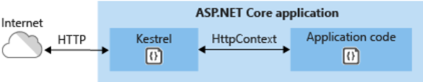
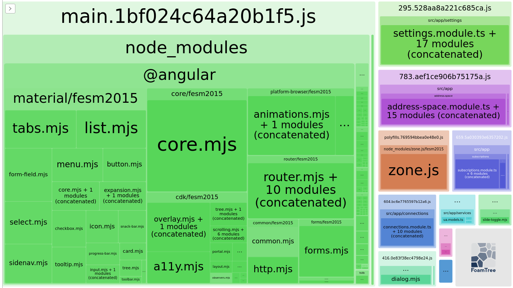
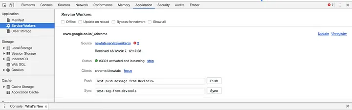

# Guidelines and Tipps

# Table of Contents

* [Screen Reader](#screen-reader)
* [Lighthouse](#lighthouse)
* [Kestrel and IIS](#kestrel-and-iis)
* [Angular](#angular)
  * [HTML Escaping](#html-escaping)
  * [Budgets](#budgets)
  * [Increase Budget](#increase-budget)
  * [Analyse Bundle](#analyse-bundle)
  * [Optimize Bundle Size](#optimize-bundle-size)
* [FAQ](#faq)
  * [Debug Failed](#debug-failed)
  * [Page is not refreshing after Update](#page-is-not-refreshing-after-update)
  * [HTTP 415 Unsupported Media Type response](#http-415-unsupported-media-type-response)

# Screen Reader

The web development guidelines to support screen readers shall be respected.

> [How to Design Your Website for Screen Reader Accessibility](https://blog.hubspot.com/website/screen-reader-accessibility)

Screen readers are used by individuals who are blind or have low-vision to use computer devices because it renders visual information coming from the computer into speech or braille,.

It is not intended to provide tests to validate the correct behavior for screen readers.

# Lighthouse

[Lighthouse](https://developer.chrome.com/docs/lighthouse/overview/) is an open-source, automated tool for improving the quality of web pages. You can run it against any web page, public or requiring authentication. It has audits for performance, accessibility, progressive web apps, SEO, and more.

# Kestrel and IIS

Kestrel is a lightweight, cross-platform, and open-source web server for ASP.NET Core. It is included and enabled by default in ASP.NET Core. Kestrel is supported on all platforms and versions supported by .NET Core.

Though Kestrel can serve an ASP.NET Core application on its own, Microsoft recommends using it along with a reverse proxy such as Apache, IIS, or Nginx for better performance, security, and reliability.

The main difference between IIS and Kestrel is that Kestrel is a cross-platform server. It runs on Linux, Windows, and Mac, whereas IIS is Windows-specific.

Another essential difference between the two is that Kestrel is fully open-source, whereas IIS is closed-source and developed and maintained only by Microsoft.

IIS is an old, albeit powerful software. With Kestrel, Microsoft started with cross-platform and high performance as explicit design goals. Since the Kestrel codebase started from scratch, it allowed developers to ignore the legacy/compatibility issues and focus on speed and efficiency.

However, Kestrel doesn’t provide all the rich functionality of a full-fledged web server such as IIS, Nginx, or Apache. Hence, we typically use it as an application server, with one of the above servers acting as a reverse proxy.

# Angular

## HTML Escaping

Angular automatically escapes data if you use `ng-bind` or the `{{ curly brace syntax }}` .

## Budgets

Budgets is one of the less known features of the Angular CLI. It’s a rather small but a very neat feature!

As applications grow in functionality, they also grow in size. Budgets is a feature in the Angular CLI which allows you to set budget thresholds in your configuration to ensure parts of your application stay within boundaries which you set.

Or in other words, we can describe our Angular application as a set of compiled JavaScript files called bundles which are produced by the build process. Angular budgets allows us to configure expected sizes of these bundles. More so, we can configure thresholds for conditions when we want to receive a warning or even fail build with an error if the bundle size gets too out of control!

## Increase Budget

Open `src/ClientApp/angular.json` file and find budgets keyword

~~~json
"budgets": [
  {
    "type": "initial",
    "maximumWarning": "2mb",
    "maximumError": "5mb"
  }
]
~~~

## Analyse Bundle

If your bundle size does get too big you may want to analyze your bundle because you may have used an inappropriate large-sized third party package or you forgot to remove some package if you are not using it anymore. Webpack has an amazing feature to give us a visual idea of the composition of a webpack bundle.

It’s super easy to get this graph.

~~~
sudo npm install -g webpack-bundle-analyzer
~~~

In your Angular app, run

~~~
`ng build --stats-json`
~~~

(don’t use flag `--prod`). By enabling `--stats-json` you will get an additional file `stats.json`.

Finally, run 

~~~
webpack-bundle-analyzer ./dist/stats.json
~~~

and your browser will pop up the page at `localhost:8888`. Have fun with it.

## Optimize Bundle Size

See [Optimize Angular bundle size in 4 steps](https://medium.com/angular-in-depth/optimize-angular-bundle-size-in-4-steps-4a3b3737bf45)

# FAQ

## Debug Failed

- Not hitting breakpoint
- breadpoint not working

- VSCode Issue: https://github.com/angular/angular-cli/issues/24601
  - https://github.com/microsoft/vscode/issues/167353
  - You can make Node 18 work by adding `--host=127.0.0.1` to the `ng serve` command.
- Unsuppoted NodeJS version: https://stackoverflow.com/a/74702135
- Or you might need to check whether you set the correct `webroot` path in the `launch.json`
  ~~~json
  "serverReadyAction": {
    "action": "debugWithChrome",
    "pattern": "\\bNow listening on:\\s+(https?://\\S+)",
    "webRoot": "${workspaceFolder}/securitytools/src/ClientApp",
  },
  ~~~

## Page is not refreshing after Update

You might need to unregister the service worker.

- Go to Developer Tools or right-click on any page element, then click `Inspect`.
- Go to the `Application` tab and then click on `service workers` in the left bar. It will list all the registered service workers.
- Click on `unregister` to disable that particular service worker.

## HTTP 415 Unsupported Media Type response

For nullable parameters of controllers it might be necessary to add the `EmptyBodyBehavior` property.
~~~C#
public IActionResult GetFilesystemEntries([FromBody(EmptyBodyBehavior = EmptyBodyBehavior.Allow)] FilesystemEntry? parent = null)
~~~

Furthermore the `Content-Type` must be set in the request header (see also [issue](https://github.com/dotnet/aspnetcore/issues/36466)).

~~~ts
return this.http.post<void>("path", null, {
  headers: new HttpHeaders().set('Content-Type', 'application/json')
});
~~~