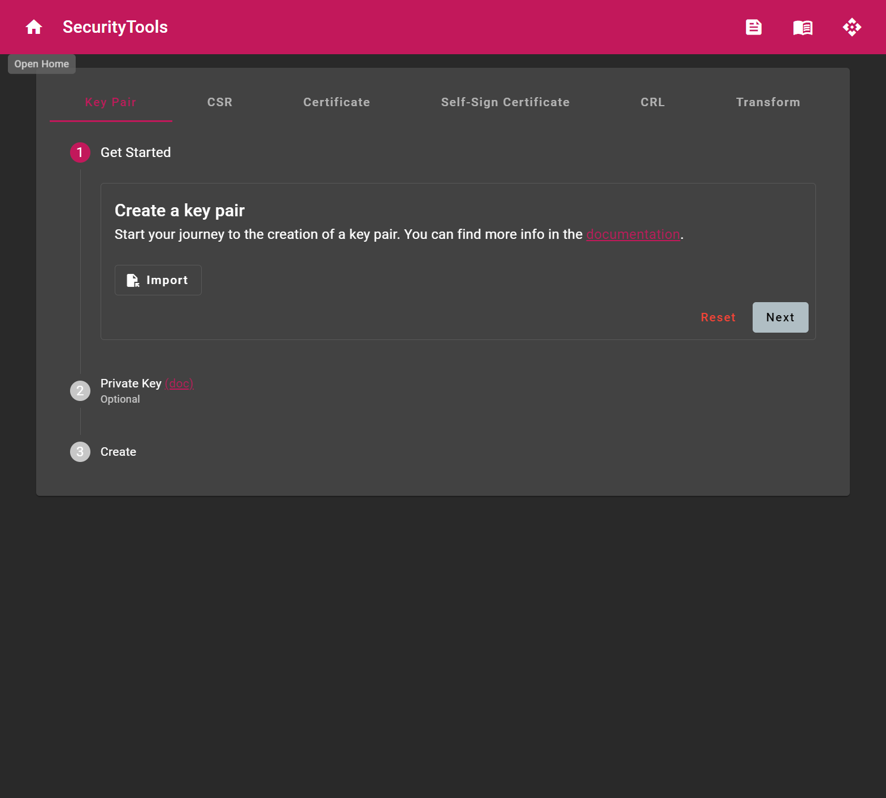
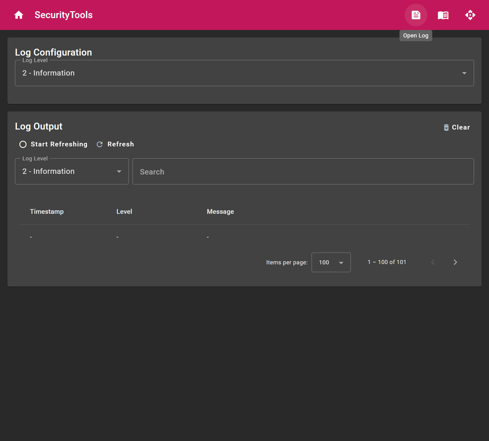
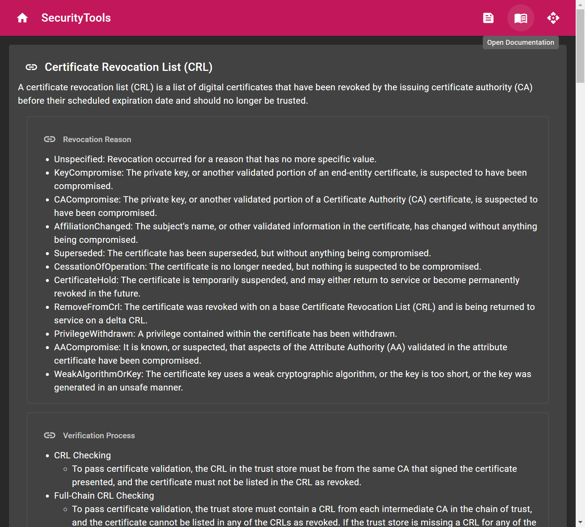
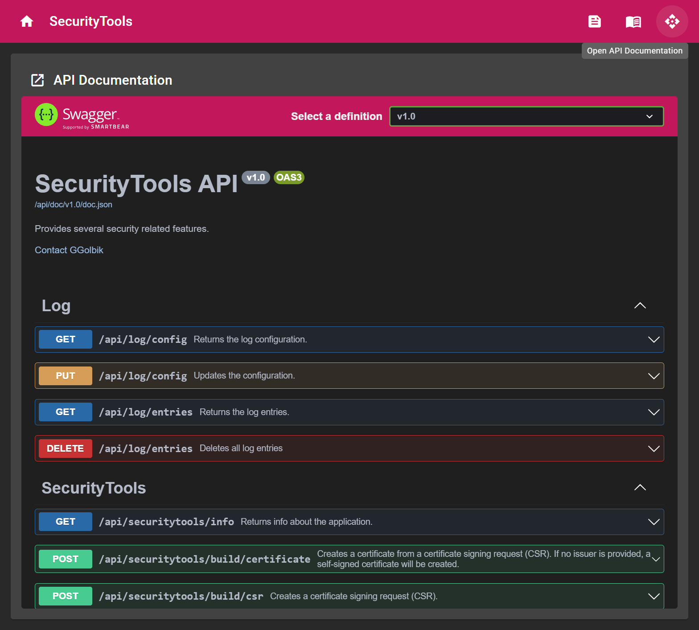

# User Manual

# Table of Contents

* [Installation](#installation)
  * [Supported Targets](#supported-targets)
  * [Deployment](#deployment)
  * [Windows](#windows)
    * [Archive - Self Contained](#archive---self-contained)
    * [Install as Service](#install-as-service)
    * [Autostart](#autostart)
    * [Start Web](#start-web)
  * [Linux](#linux)
    * [Archive - Self Contained](#archive---self-contained-1)
    * [DEB - Self Contained](#deb---self-contained)
    * [Install as Service](#install-as-service-1)
    * [Start Web](#start-web-1)
  * [Docker](#docker)
* [App Data](#app-data)
* [Configuration](#configuration)
  * [Sources](#sources)
    * [appsettings.json](#appsettingsjson)
    * [Environment Variables](#environment-variables)
    * [Command line arguments](#command-line-arguments)
  * [Web Server](#web-server)
    * [Endpoint](#endpoint)
    * [Limits](#limits)
  * [Serilog](#serilog)
* [User Interface](#user-interface)
  * [Home](#home)
  * [Log](#log)
  * [Doc](#doc)
  * [API](#api)
* [RESTful API](#restful-api)

# Installation

## Supported Targets

## Deployment

The Windows and Linux packages are distributed as [self contained ~~and framework dependent~~](https://docs.microsoft.com/en-us/dotnet/core/deploying/) application.

- **framework-dependent**: Publishing your app as framework-dependent produces an application that includes only your application itself and its dependencies. Users of the application have to separately install the .NET runtime.
    - **Small deployment**: Only your app and its dependencies are distributed. The .NET runtime and libraries are installed by the user and all apps share the runtime.
    - **Requires pre-installing the runtime**: Your app can run only if the version of .NET your app targets is already installed on the host system.
    - **Uses the latest patched runtime**:  The app uses the latest runtime (within the targeted major-minor family of .NET) installed on the target system. This means your app automatically uses the latest patched version of the .NET runtime. This default behavior can be overridden. For more information, see framework-dependent apps roll forward.
    - **.NET may change**: It's possible for the .NET runtime and libraries to be updated on the machine where the app is run. In rare cases, this may change the behavior of your app if you use the .NET libraries, which most apps do.
        - [Framework-dependent apps roll-forward](https://learn.microsoft.com/en-us/dotnet/core/versions/selection#framework-dependent-apps-roll-forward)
- **self-contained**: Publishing your app as self-contained produces an application that includes the .NET runtime and libraries, and your application and its dependencies. Users of the application can run it on a machine that doesn't have the .NET runtime installed.
    - **Larger deployments**: Because your app includes the .NET runtime and all of your app dependencies.
    - **No pre-installing required**: You control which version of .NET is deployed with your app.
    - **Harder to update the .NET version**:  .NET Runtime (distributed with your app) can only be upgraded by releasing a new version of your app.

It's recommended to use the framework dependent package because this allows to update the .NET Runtime if necessary for security reasons.

For additional information see [.NET application publishing introduction ](https://learn.microsoft.com/en-us/dotnet/core/deploying/).

## Windows

The following sub sections provide information for the installation on Windows.

### Archive - Self Contained

- Extract the `ggolbik-securitytools-*.zip`.
- Execute `SecurityTools.exe`.

### Install as Service

The `install-service.bat` script can be used to install the application as Windows service.

### Autostart

If the application is not setup as a Windows service, it is also possible to add a reference to the Autostart in Windows.
Therefore a shortcut to the application must be placed in `C:\Users\<user>\AppData\Roaming\Microsoft\Windows\Start Menu\Programs\Startup`.

### Start Web

- Start a browser.
  - Google Chome, Mircosoft Edge and Mozilla Firefox are supported.
- Open [http://localhost:5000](http://localhost:5000) or [https://localhost:5001](https://localhost:5001).

> Some browsers like Google Chrome expect the HTTPS protocol by default. In this case you cannot access the page by entering just `localhost:5000` in the address bar because only the HTTP protocol is located at port 5000 but the HTTPS protocol is available at port 5001.

## Linux

The following sub sections provide information for the installation on Linux.

### Archive - Self Contained

- Extract the `ggolbik-securitytools-*.tar.gz`.
- Execute `SecurityTools`.

### DEB - Self Contained

- Install the deb package with `sudo dpkg -i ggolbik-securitytools-<VERSION>_<ARCHITECTURE>.deb`.
- Execute `SecurityTools`.

### Install as Service

The `/opt/ggolbik/securitytools/install-service.sh` script can be used to install the application as systemd service.

### Start Web

- Start a browser.
  - Google Chome, Mircosoft Edge and Mozilla Firefox are supported.
- Open [http://localhost:5000](http://localhost:5000) or [https://localhost:5001](https://localhost:5001).

> Some browsers like Google Chrome expect the HTTPS protocol by default. In this case you cannot access the page by entering just `localhost:5000` in the address bar because only the HTTP protocol is located at port 5000 but the HTTPS protocol is available at port 5001.

## Docker

Load the docker image with:

~~~
cat ggolbik-securitytools_docker.tar.gz | docker load
~~~

Type the following command to run the web application:

~~~
docker run -it --rm -p 8000:80 --name securitytools ggolbik/securitytools
~~~

or type

~~~
docker run -itd -p 8000:80 -p 8443:443 --name securitytools ggolbik/securitytools
~~~

Afterwards you are able to access the website at [http://localhost:8000/](http://localhost:8000/) or [https://localhost:8443/](https://localhost:8443/).

> Some browsers like Google Chrome expect the HTTPS protocol by default. In this case you cannot access the page by entering just `localhost:8000` in the address bar because at port 8000 is the HTTP protocol but the HTTPS protocol is at port 8443.

# App Data

The location of application data differs on Windows and Linux as well as whether the app is started as a service or as a user interactive program.

Windows:
- `C:\ProgramData` ([SpecialFolder.CommonApplicationData](https://learn.microsoft.com/de-de/dotnet/api/system.environment.specialfolder?view=net-6.0))
  - *The file system directory that contains application data for all users.*
  - *This folder is used for application data that is not user specific.*
- `C:\ProgramData\ggolbik\securitytools`
  - The default path if the program is executed as a service.
- `C:\Users\<username>\AppData`
  - *The file system directory that serves as a common repository for application-specific data.*
- `C:\Users\<username>\AppData\Roaming` ([SpecialFolder.ApplicationData](https://learn.microsoft.com/de-de/dotnet/api/system.environment.specialfolder?view=net-6.0))
  - *Roaming is where programs on your machine store data that is specific to your user account.*
- `C:\Users\<username>\AppData\Roaming\ggolbik\securitytools`
  - The default path if the program is executed as a user interactive program.

The directory is chosen based on [Environment.UserInteractive Property](https://learn.microsoft.com/de-de/dotnet/api/system.environment.userinteractive?view=net-6.0).

For additional information see [CSIDL](https://learn.microsoft.com/en-us/windows/win32/shell/csidl?redirectedfrom=MSDN).

Linux:
- `/var`
  - *Variable files: files whose content is expected to continually change during normal operation of the system, such as logs, spool files, and temporary e-mail files.*
- `/var/opt`
  - *Variable data from add-on packages that are stored in /opt.*
- `/var/opt/ggolbik/securitytools`
  - The default path if the program is executed as a service.
- `/home/<username>/.config` ([SpecialFolder.ApplicationData](https://learn.microsoft.com/de-de/dotnet/api/system.environment.specialfolder?view=net-6.0))
  - *User-specific configuration files are stored here.*
- `/home/<username>/.config/ggolbik/securitytools`
  - The default path if the program is executed as a user interactive program.

The directory is chosen based on the fact whether the parameter (environment variable) [`INVOCATION_ID`](https://serverfault.com/a/927481) is set or not. The parameter should be set if started by systemd.

> The access to the directory should be restricted to the application process only and the filesystem should be encrypted. 

# Configuration

## Sources

The application follows the [default mechanisms defined by ASP.NET](https://docs.microsoft.com/en-us/aspnet/core/fundamentals/configuration/?view=aspnetcore-6.0).
The settings are loaded from different sources in the following order from lowest to highest priority:

1. Fallback to the [host configuration](https://docs.microsoft.com/en-us/aspnet/core/fundamentals/configuration/?view=aspnetcore-6.0#default-host-configuration-sources).
    - `DOTNET_`-prefixed environment variables using the Environment variables configuration provider.
    - Command-line arguments using the Command-line configuration provider
    - `ASPNETCORE_`-prefixed environment variables using the Environment variables configuration provider.
2. `appsettings.json` located in the directory of the assembly.
3. `appsettings.{Environment}.json`: values override keys in `appsettings.json`. For example, the `appsettings.Production.json` and `appsettings.Development.json` files. The environment version of the file is loaded based on the `IHostingEnvironment.EnvironmentName`. For additional information see [Use multiple environments in ASP.NET Core](https://docs.microsoft.com/en-us/aspnet/core/fundamentals/environments?view=aspnetcore-6.0).
4. Non-prefixed environment variables using the Non-prefixed environment variables configuration provider.
5. Command-line arguments using the Command-line configuration provider.

If a settings source is loaded and the key already exists from a previous source, it overwrites the previous value.

The settings cannot be changed during runtime.

### appsettings.json

The `appsettings.json` file is searched in the directory of the assembly.

> The file `appsettings.{Environment}.json` is used to override the keys in `appsettings.json` with deployment environment specific settings. For Example a file named `appsettings.production.json` would contain values specific to production.
> [Order of Precedence when Configuring ASP.NET Core by Randy Patterson, April 15th, 2018](https://devblogs.microsoft.com/premier-developer/order-of-precedence-when-configuring-asp-net-core/)

> The access to the directory should be restricted to authorized users only. 

### Environment Variables

> Environment variables are a cross-platform way of storing configuration values and are available on Windows, Linux and Mac. While running on Windows you probably will not use environment variables often but they are used extensively by container orchestrators like Docker Compose and Kubernetes.
> [Order of Precedence when Configuring ASP.NET Core by Randy Patterson, April 15th, 2018](https://devblogs.microsoft.com/premier-developer/order-of-precedence-when-configuring-asp-net-core/)

The `:` separator doesn't work with environment variable hierarchical keys on all platforms. `__`, the double underscore, is:
- Supported by all platforms. For example, the `:` separator is not supported by Bash, but `__` is.
- Automatically replaced by a `:`

Example Windows:
~~~
set SecurityTools__SettingsDirectory="/tmp/settings"
SecurityTools.exe
~~~

Example Linux:
~~~
export SecurityTools__SettingsDirectory="/tmp/settings"
SecurityTools
~~~

For additional information see [Non-prefixed environment variables](https://learn.microsoft.com/en-us/aspnet/core/fundamentals/configuration/?tabs=basicconfiguration&view=aspnetcore-6.0#non-prefixed-environment-variables) and [Naming of environment variables](https://learn.microsoft.com/en-us/aspnet/core/fundamentals/configuration/?tabs=basicconfiguration&view=aspnetcore-6.0#naming-of-environment-variables).

### Command line arguments

> Command line arguments allow you to update configuration keys when running your application without modifying any files. Any configuration value can be modified at the command line by using the command line syntax of `key=value`. For example, to change a key of ConnectionString at runtime you can pass the string `ConnectionString="My new connection string"`.
> [Order of Precedence when Configuring ASP.NET Core by Randy Patterson, April 15th, 2018](https://devblogs.microsoft.com/premier-developer/order-of-precedence-when-configuring-asp-net-core/)

The key value must follow `=`, or the key must have a prefix of `--` or `/` when the value follows a space.

Example:
~~~
SecurityTools.exe --SecurityTools:SettingsDirectory="/tmp/settings"
~~~

For additional information see [Command-line arguments](https://learn.microsoft.com/en-us/aspnet/core/fundamentals/configuration/?tabs=basicconfiguration&view=aspnetcore-6.0#command-line-arguments).

## Web Server

The server uses Kestrel which is a cross-platform web server for ASP.NET Core. Kestrel provides several configuration options.

### Endpoint

If no ports are specified, the application binds to:
- HTTP: http://localhost:5000
- HTTPS: https://localhost:5001

The docker container binds to:
- HTTP: http://localhost:80
- HTTPS: https://localhost:443

Specify URLs by using the `Urls` parameter. Configure the value as a semicolon-separated list, e.g.:
~~~json
{
  "Urls": "http://localhost:8000;https://localhost:8443"
}
~~~

You can also configure it through the `Kestrel` section in the settings:
~~~json
{
  "Kestrel": {
    "Endpoints": {
      "Http": {
        "Url": "http://localhost:5000"
      },
      "Https": {
        "Url": "https://localhost:5001"
      }
    }
  }
}
~~~

For additional information see [Configure endpoints for the ASP.NET Core Kestrel web server](https://docs.microsoft.com/en-us/aspnet/core/fundamentals/servers/kestrel/endpoints?view=aspnetcore-6.0).

*Notice: A self signed certificate is used for HTTPS (see [Certificates](../certificates/README.md)) and overwrites the kestrel settings.* 

### Limits

The Limits section allows to set important properties, e.g. the `MaxRequestBodySize` or `MaxConcurrentConnections`. 

Example:
~~~json
{
  "Kestrel": {
    "Limits": {
      "MaxConcurrentConnections": 100,
      "MaxRequestBodySize": 100000000
    }
  }
}
~~~

For additional information see [Configure options for the ASP.NET Core Kestrel web server](https://learn.microsoft.com/de-de/aspnet/core/fundamentals/servers/kestrel/options?view=aspnetcore-6.0).

## Serilog

The application uses [Serilog](https://serilog.net/) for logging.

Serilog is independent of .NET Core and most of the framework infrastructure (including configuration and dependency injection), making it well-suited to collecting and recording problems with starting up the framework itself, which is a critical role for a logging library.

The following log [sinks](https://github.com/serilog/serilog/wiki/Provided-Sinks) are used:

- [Async](https://github.com/serilog/serilog-sinks-async)
- [Console](https://github.com/serilog/serilog-sinks-console)
- [File](https://github.com/serilog/serilog-sinks-file)
  - The log file size limit is set to 1GB.
  - Only the most recent 8 files are retained
- [SQLite](https://github.com/saleem-mirza/serilog-sinks-sqlite)
  - The log file size limit is set to 1GB.

The default format for the preconfigured sinks is `[{Timestamp:yyyy-MM-dd HH:mm:ss.ffffff}] [{Level:u3}] [{SourceContext}] {Message:lj}{NewLine}{Exception}`.

The default log level is `Information`. The default value can be set in the settings by `Serilog:MinimumLevel:Default`. 

The log levels are used as described below:

- `Verbose (Trace)`: tracing information and debugging; generally only switched on in unusual situations
- `Debug`: internal control flow and diagnostic state dumps to facilitate pinpointing of recognized problems
- `Information`: events of interest or that have relevance to outside observers; the default enabled minimum logging level
- `Warning`: indicators of possible issues or service/functionality degradation
- `Error`: indicating a failure within the application or connected system
- `Fatal/Critical`: critical errors causing complete failure of the application

For additional information see [Logging in .NET Core and ASP.NET Core](https://learn.microsoft.com/en-us/aspnet/core/fundamentals/logging/?view=aspnetcore-6.0).

# User Interface

## Home

The home page provides features to
- create a key pair
- create a certificate signing request (CSR)
- create a certificate
- create a self-signed certificate.
- create a certificate revocation list (CRL)
- transform files to different encodings.

It should be self-explanatory to use.

## Log

The log page allows to view all log messages. 

## Doc

The documentation page provides information and references to specifications which are helpful to unterstand the provided features.

## API

The API page allows to use the REST API. Read also [RESTful API](#restful-api).

# RESTful API

The [OpenAPI Specification](https://swagger.io/specification/) ([OAS](https://spec.openapis.org/oas/latest.html)) defines a standard, language-agnostic interface to RESTful APIs which allows both humans and computers to discover and understand the capabilities of the service without access to source code, documentation, or through network traffic inspection. When properly defined, a consumer can understand and interact with the remote service with a minimal amount of implementation logic.

An OpenAPI definition can then be used by documentation generation tools to display the API, code generation tools to generate servers and clients in various programming languages, testing tools, and many other use cases.

The Representational State Transfer (REST) API is implemented by using the Hypertext Transfer Protocol (HTTP; [Schemas - RFC 7231](https://www.rfc-editor.org/rfc/rfc7231)).
- GET: Allows the client to retrieve whatever information is identified by the Request-URI. [RFC 2616](https://www.rfc-editor.org/rfc/rfc2616#section-9)
- HEAD: The HEAD method is identical to GET except that the server MUST NOT return a message-body in the response. [RFC 2616](https://www.rfc-editor.org/rfc/rfc2616#section-9)
- POST: Allows the client to create resources without knowing the URI for the new resource. Could also be used to create a temporary resource which is not saved on the server, e.g. a file export. [RFC 2616](https://www.rfc-editor.org/rfc/rfc2616#section-9)
  - POST request-URI should be of a collection URI e.g. `POST /items`
- PUT: Allows the client to replace an existing resource. [RFC 2616](https://www.rfc-editor.org/rfc/rfc2616#section-9)
  - If the Request-URI refers to an already existing resource – an update operation will happen, otherwise create operation should happen if Request-URI is a valid resource URI (assuming the client is allowed to determine resource identifier). `PUT /items/{id}`-
  - PUT replaces the resource in its entirety. Use PATCH if request updates part of the resource.
- PATCH: Allows the client to apply partial modifications to a resource. [RFC 5789: PATCH Method for HTTP](https://www.rfc-editor.org/rfc/rfc5789)
- DELETE: Allows the client to delete the resource identified by the Request-URI. [RFC 2616](https://www.rfc-editor.org/rfc/rfc2616#section-9)

