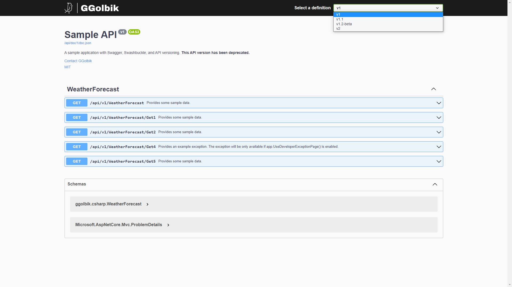
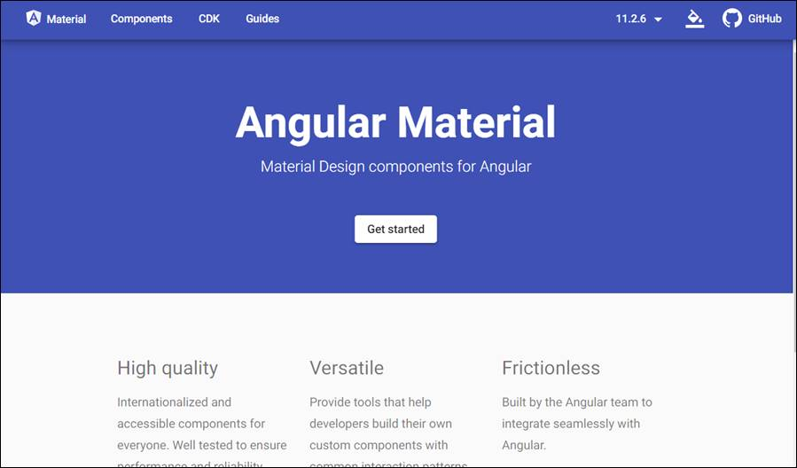
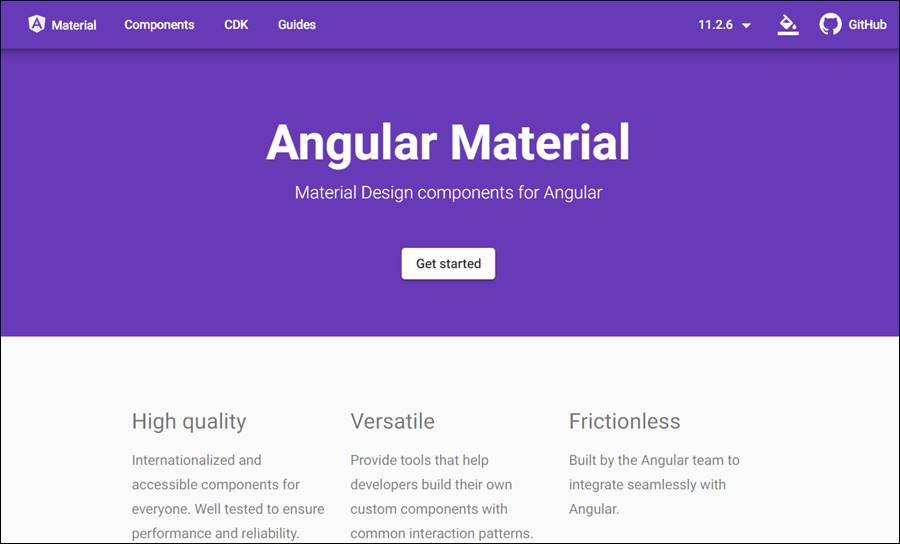
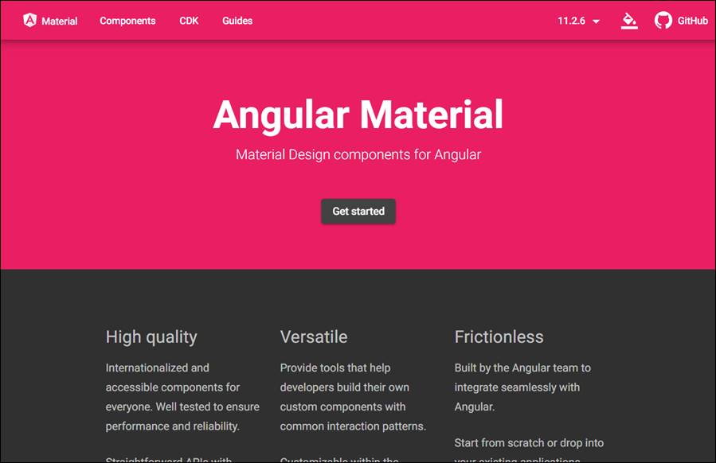
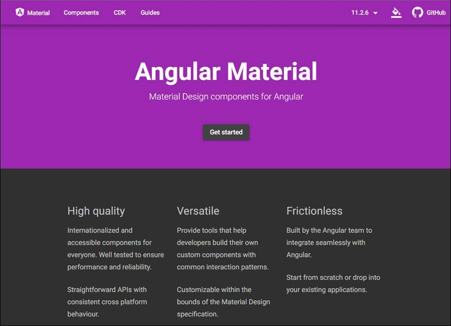

# SecurityTools Setup

# Table of Contents

* [Table of Contents](#table-of-contents)
* [Project Settings](#project-settings)
* [Create Project](#create-project)
  * [Create Core Library Project](#create-core-library-project)
  * [Create UI Project](#create-ui-project)
  * [Create App Project](#create-app-project)
  * [Add Electron](#add-electron)
  * [VSCode](#vscode)
* [Create Test Project](#create-test-project)
  * [XUnit](#xunit)
  * [Packages](#packages)
  * [VSCode](#vscode-1)
* [API Versioning](#api-versioning)
  * [Configure](#configure)
  * [Lowercase Routing](#lowercase-routing)
* [API Documentation](#api-documentation)
  * [Swagger Path](#swagger-path)
  * [Dark CSS](#dark-css)
  * [Pages](#pages)
  * [API Comments](#api-comments)
* [CommandLineParser](#commandlineparser)
* [Logging](#logging)
* [BouncyCastle](#bouncycastle)
* [Services](#services)
  * [Install Service Scripts](#install-service-scripts)
* [Tar and Gzip](#tar-and-gzip)
* [Material Design](#material-design)
  * [Themes](#themes)
  * [Fonts](#fonts)
  * [DateTime Picker](#datetime-picker)

# Project Settings

Setting the [`MSBUildProjectExtensionsPath`](https://docs.microsoft.com/en-us/nuget/reference/msbuild-targets), `BaseOutputPath` (`bin`) and `BaseIntermediateOutputPath` (`obj`) properties in the [`Directory.Build.Props`](https://docs.microsoft.com/en-us/visualstudio/msbuild/customize-your-build?view=vs-2019) file, which is located in the root directory of your solution.
~~~xml
<Project>
  <PropertyGroup>
    <MSBUildProjectExtensionsPath>$(MSBuildProjectDirectory)\..\build\$(MSBuildProjectName)\obj\</MSBUildProjectExtensionsPath>
    <BaseOutputPath>$(MSBuildProjectDirectory)\..\build\$(MSBuildProjectName)\bin\</BaseOutputPath>
    <BaseIntermediateOutputPath>$(MSBuildProjectDirectory)\..\build\$(MSBuildProjectName)\obj\</BaseIntermediateOutputPath>
  </PropertyGroup>
</Project>
~~~

Add the `.gitignore` file and insert the below content:
~~~
/build

.angular
~~~

# Create Project

## Create Core Library Project

[.NET default templates for dotnet new - Class library](https://learn.microsoft.com/en-us/dotnet/core/tools/dotnet-new-sdk-templates#webapi)

~~~
dotnet new classlib --framework net8.0 --name SecurityToolsCore --output ./SecurityToolsCore
~~~

Change the value of `<OutputType>` to `Library` inside `*.csproj` or omit the property to produce a library:
~~~xml
<Project Sdk="Microsoft.NET.Sdk">
  <PropertyGroup>
    <OutputType>Library</OutputType>
  </PropertyGroup>
</Project>
~~~

## Create UI Project

Create angular client app:
~~~
ng new application --name SecurityToolsWeb --directory SecurityToolsWeb --standalone false --routing true
? Which stylesheet format would you like to use? CSS
? Do you want to enable Server-Side Rendering (SSR) and Static Site Generation (SSG/Prerendering)? No
~~~

Add `proxy.conf.js`
~~~js
const { env } = require('process');

const target = env.ASPNETCORE_HTTPS_PORT ? `https://localhost:${env.ASPNETCORE_HTTPS_PORT}` :
  env.ASPNETCORE_URLS ? env.ASPNETCORE_URLS.split(';')[0] : 'http://localhost:24176';

const PROXY_CONFIG = [
  {
    context: [
      "/api/**",
      "/images/**",
      "/css/**",
      "/js/**",
      "/**.txt"
   ],
    target: target,
    secure: false,
    headers: {
      Connection: 'Keep-Alive'
    }
  }
]

module.exports = PROXY_CONFIG;
~~~

Add `"proxyConfig": "proxy.conf.js"` to `"projects" > "application" > "architect" > "serve" > "configurations" > "development"`  in `angular.json`
~~~json
"serve": {
  "builder": "@angular-devkit/build-angular:dev-server",
  "configurations": {
    "production": {
      "buildTarget": "application:build:production"
    },
    "development": {
      "buildTarget": "application:build:development",
      "proxyConfig": "proxy.conf.js"
    }
  },
  "defaultConfiguration": "development"
}
~~~

Add `server` to `"projects" > "application" > "architect"`  in `angular.json` to detech changes while debugging
~~~json
"architect": {
  "server": {
    "builder": "@angular-devkit/build-angular:server",
    "options": {
      "outputPath": "dist-server",
      "main": "src/main.ts",
      "tsConfig": "tsconfig.server.json"
    },
    "configurations": {
      "dev": {
        "optimization": true,
        "outputHashing": "all",
        "sourceMap": false,
        "namedChunks": false,
        "extractLicenses": true,
        "vendorChunk": true
      },
      "production": {
        "optimization": true,
        "outputHashing": "all",
        "sourceMap": false,
        "namedChunks": false,
        "extractLicenses": true,
        "vendorChunk": false
      }
    }
  }
}
~~~

## Create App Project

[.NET default templates for dotnet new - ASP.NET Core Web API](https://learn.microsoft.com/en-us/dotnet/core/tools/dotnet-new-sdk-templates#webapi)

Create a new angular application project:
~~~
dotnet new webapi --no-https --framework net8.0 --name SecurityTools --output ./SecurityToolsApp
~~~

Add SecurityToolsCore reference:
~~~
dotnet add reference ../SecurityToolsCore/
~~~

Add `SpaProxy*` to `SecurityTools.csproj` to combine .Net and Angular app:
~~~
dotnet add package Microsoft.AspNetCore.SpaProxy
~~~

Update `Properties/launchSettings.json`:
- Change `"launchUrl": "swagger",` to `"launchUrl": "",`
- Add in profile `http` the entry `"ASPNETCORE_HOSTINGSTARTUPASSEMBLIES": "Microsoft.AspNetCore.SpaProxy"` to `environmentVariables`

~~~xml
  <PropertyGroup>
    <SpaRoot>../SecurityToolsWeb/</SpaRoot>
    <SpaProxyServerUrl>http://localhost:44463</SpaProxyServerUrl>
    <SpaProxyLaunchCommand>npm start</SpaProxyLaunchCommand>
  </PropertyGroup>

  <ItemGroup>
    <!-- Don't publish the SPA source files, but do show them in the project files list -->
    <Content Remove="$(SpaRoot)**" />
    <None Remove="$(SpaRoot)**" />
    <None Include="$(SpaRoot)**" Exclude="$(SpaRoot)node_modules\**" />
  </ItemGroup>

  <Target Name="DebugEnsureNodeEnv" BeforeTargets="Build"
    Condition=" '$(Configuration)' == 'Debug' And !Exists('$(SpaRoot)node_modules') ">
    <!-- Ensure Node.js is installed -->
    <Exec Command="node --version" ContinueOnError="true">
      <Output TaskParameter="ExitCode" PropertyName="ErrorCode" />
    </Exec>
    <Error Condition="'$(ErrorCode)' != '0'"
      Text="Node.js is required to build and run this project. To continue, please install Node.js from https://nodejs.org/, and then restart your command prompt or IDE." />
    <Message Importance="high"
      Text="Restoring dependencies using 'npm'. This may take several minutes..." />
    <Exec WorkingDirectory="$(SpaRoot)" Command="npm install" />
  </Target>

  <Target Name="PublishRunWebpack" AfterTargets="ComputeFilesToPublish">
    <!-- As part of publishing, ensure the JS resources are freshly built in production mode -->
    <Exec WorkingDirectory="$(SpaRoot)" Command="npm install" />
    <Exec WorkingDirectory="$(SpaRoot)" Command="npm run build --" />

    <!-- Include the newly-built files in the publish output -->
    <ItemGroup>
      <DistFiles Include="$(SpaRoot)dist\application\browser\**; $(SpaRoot)dist-server\**; $(SpaRoot)dist\application\3rdpartylicenses.txt" />
      <ResolvedFileToPublish Include="@(DistFiles->'%(FullPath)')"
        Exclude="@(ResolvedFileToPublish)">
        <RelativePath>wwwroot\%(RecursiveDir)%(FileName)%(Extension)</RelativePath>
        <CopyToPublishDirectory>PreserveNewest</CopyToPublishDirectory>
        <ExcludeFromSingleFile>true</ExcludeFromSingleFile>
      </ResolvedFileToPublish>
    </ItemGroup>
  </Target>
~~~

Add project info to `src/SecurityTools.csproj`:
~~~xml
<PropertyGroup>
  <Title>SecurityTools</Title>
  <Description>Provides several security related features.</Description>
  <Authors>GGolbik</Authors>
  <Copyright>Copyright © GGolbik 2024</Copyright>
  <!-- Version: (<major>.<minor>.<build/patch>) is the only version the Common Language Runtime (CLR) cares about. -->
  <Version>0.0.0</Version>
  <!-- InformationalVersion: is intended to represent the version of your entire product -->
  <InformationalVersion></InformationalVersion>
</PropertyGroup>

<ItemGroup Condition="$(ReleaseDate) != ''">
  <!-- Add parameter /property:ReleaseDate=yyyy-MM-ddTHH:mm:ssZ at dotnet build command -->
  <AssemblyMetadata Include="ReleaseDate" Value="$(ReleaseDate)" />
</ItemGroup>

<ItemGroup Condition="$(VersionName) != ''">
  <!-- Add parameter /property:VersionName=Awesome at dotnet build command -->
  <AssemblyMetadata Include="VersionName" Value="$(VersionName)" />
</ItemGroup>
~~~

## Add Electron

See also [Electron in DEV.md](./DEV.md#electron).

Electron is a framework for building desktop applications using JavaScript, HTML, and CSS. By embedding Chromium and Node.js into its binary

Add [ElectronNET.API](https://www.nuget.org/packages/ElectronNET.API/) to `SecurityTools.csproj`:
~~~
dotnet add package ElectronNET.API
~~~

Once you’ve installed it, we must tell to use Electron in the app. Open VS Code (using the command Code .), and, in Program.cs, add:
~~~C#
using ElectronNET.API;

var builder = WebApplication.CreateBuilder(args);

builder.WebHost.UseElectron(args);
~~~

Then, in the end of the file we’ll create the main Electron window:
~~~C#
if (HybridSupport.IsElectronActive)
{
    CreateElectronWindow();
}

app.Run();

async void CreateElectronWindow()
{
    var window = await Electron.WindowManager.CreateWindowAsync();
    window.OnClosed += () => Electron.App.Quit();
}
~~~

Once we do that, we can use the tool using the electronizecommand. We will initialize the project with:
~~~
electronize init
~~~

~~~
electronize build /target win
electronize build /target linux
~~~

You can edit the menu if you like:
~~~C#
var fileMenu = new MenuItem[]
{
    new MenuItem { Label = "Home", 
                            Click = () => Electron.WindowManager.BrowserWindows.First().LoadURL($"http://localhost:{BridgeSettings.WebPort}/") },
    new MenuItem { Label = "Privacy", 
                            Click = () => Electron.WindowManager.BrowserWindows.First().LoadURL($"http://localhost:{BridgeSettings.WebPort}/Privacy") },
    new MenuItem { Type = MenuType.separator },
    new MenuItem { Role = MenuRole.quit }
};

var viewMenu = new MenuItem[]
{
    new MenuItem { Role = MenuRole.reload },
    new MenuItem { Role = MenuRole.forcereload },
    new MenuItem { Role = MenuRole.toggledevtools },
    new MenuItem { Type = MenuType.separator },
    new MenuItem { Role = MenuRole.resetzoom },
    new MenuItem { Role = MenuRole.zoomin },
    new MenuItem { Role = MenuRole.zoomout },
    new MenuItem { Type = MenuType.separator },
    new MenuItem { Role = MenuRole.togglefullscreen }
};

var menu = new MenuItem[] 
{
    new MenuItem { Label = "File", Type = MenuType.submenu, Submenu = fileMenu },
    new MenuItem { Label = "View", Type = MenuType.submenu, Submenu = viewMenu }
};

Electron.Menu.SetApplicationMenu(menu);

var options = new BrowserWindowOptions
{
    Width = 1024,
    Height = 1024
};
var window = await Electron.WindowManager.CreateWindowAsync(options);
window.OnClosed += () => Electron.App.Quit();
~~~

See also [electron-builder](https://www.electron.build/).

## VSCode

Add `task.json` and `launch.json` for debugging:

*Note: The `kill-ng-serve` task is required because the `ng serve` process is not stopped with the debugger.

`.vscode/task.json`
~~~json
{
  "version": "2.0.0",
  "tasks": [
    {
      "label": "kill-ng-serve",
      "linux": {
        "command": "fuser",
        "type": "shell",
        "args": [
          "-k",
          "4200/tcp",
          "||",
          "echo",
          "0"
        ]
      }
    },
    {
      "label": "build-securitytools",
      "command": "dotnet",
      "type": "process",
      "dependsOn": [
        "kill-ng-serve"
      ],
      "args": [
        "build",
        "${workspaceFolder}/securitytools/SecurityToolsApp/SecurityTools.csproj",
        "/property:GenerateFullPaths=true",
        "/consoleloggerparameters:NoSummary"
      ],
      "problemMatcher": "$msCompile"
    }
  ]
}
~~~

`.vscode/launch.json`:
~~~json
{
  "version": "0.2.0",
  "configurations": [
    {
      "name": "SecurityTools Debug",
      "type": "coreclr",
      "request": "launch",
      "preLaunchTask": "build-securitytools",
      "program": "${workspaceFolder}/securitytools/build/SecurityTools/bin/Debug/net8.0/SecurityTools.dll",
      "args": [],
      "cwd": "${workspaceFolder}/securitytools/SecurityToolsApp",
      "stopAtEntry": false,
      "logging": {
        "moduleLoad": false
      },
      "serverReadyAction": {
        "action": "debugWithChrome",
        "pattern": "\\bNow listening on:\\s+(https?://\\S+)",
        "webRoot": "${workspaceFolder}/securitytools/SecurityToolsWeb",
      },
      "env": {
        "ASPNETCORE_ENVIRONMENT": "Development"
      },
      "sourceFileMap": {
        "/Views": "${workspaceFolder}/Views"
      }
    }
  ]
}
~~~

Now you should be able to run the `SecurityTools Debug` launch config.

# Create Test Project

## XUnit

The xunit package brings in three child packages which include functionality that most developers want:
- xunit.core (the testing framework itself), 
- xunit.assert (the library which contains the Assert class), 
- and xunit.analyzers (which enables Roslyn analyzers to detect common issues with unit tests and xUnit.net extensibility).

The packages xunit.runner.visualstudio and Microsoft.NET.Test.Sdk are required for being able to run your test project inside Visual Studio as well as with dotnet test.

The coverlet.collector package allows collecting code coverage. If you don't intend to collect code coverage, you should remove this package reference.
~~~
dotnet new xunit --framework net7.0 --name SecurityToolsTest --output ./SecurityToolsTest
~~~

## Packages

Add ReportGenerator and coverlet.msbuild for coverage.
~~~
dotnet add package coverlet.msbuild --version 3.1.2
dotnet add package ReportGenerator --version 5.0.4
~~~

~~~
dotnet add package FluentAssertions
~~~

The test result can be found in `build/test/result.html`. The coverage report can be found in `build/test/coverage/index.htm`.

## VSCode

`task.json`
~~~json
{
  "version": "2.0.0",
  "tasks": [
    {
      "label": "build-securitytools-test",
      "command": "dotnet",
      "type": "process",
      "args": [
        "build",
        "${workspaceFolder}/securitytools/SecurityToolsTest/SecurityToolsTest.csproj",
        "/property:GenerateFullPaths=true",
        "/consoleloggerparameters:NoSummary"
      ],
      "problemMatcher": "$msCompile"
    }
  ]
}
~~~

`launch.json`:
~~~json
{
  "version": "0.2.0",
  "configurations": [
    {
      "name": "SecurityTools Debug XUnit Tests",
      "type": "coreclr",
      "request": "launch",
      "preLaunchTask": "build-securitytools-test",
      // If you have changed target frameworks, make sure to update the program path.
      "program": "dotnet",
      "args": [
        "test",
        //"--filter",
        //"FullyQualifiedName=SecurityToolsTest.Config.ConfigurationServiceTest.Configuration_UpdateApplicationUri",
        "${workspaceFolder}/securitytools/build/SecurityToolsTest/bin/Debug/net8.0/SecurityToolsTest.dll"
      ],
      "env": {
        "VSTEST_HOST_DEBUG": "1"
      },
      "cwd": "${workspaceFolder}/securitytools/SecurityToolsTest",
      // For more information about the 'console' field, see https://aka.ms/VSCode-CS-LaunchJson-Console
      "console": "internalConsole",
      "stopAtEntry": false,
      "logging": {
        "moduleLoad": false
      },
    },
    {
      "name": ".NET Core Attach",
      "type": "coreclr",
      "request": "attach",
      "justMyCode": false,
      "enableStepFiltering": false,
      "requireExactSource": false,
      "symbolOptions": {
        "searchPaths": [],
        "searchMicrosoftSymbolServer": true,
        "searchNuGetOrgSymbolServer": true
      },
    },
  ]
}
~~~

# API Versioning

Add `Asp.Versioning.Mvc` and `Asp.Versioning.Mvc.ApiExplorer` to allow versioning of the REST API.
~~~
dotnet add package Asp.Versioning.Mvc
dotnet add package Asp.Versioning.Mvc.ApiExplorer
~~~

The API versioning extensions define simple metadata attributes and conventions that you use to describe which API versions are implemented by your services. You don't need to learn any new routing concepts or change the way you implement your services in ASP.NET today. The [wiki](https://github.com/Microsoft/aspnet-api-versioning/wiki) provides more information.

## Configure

Add API Versioning to the project

~~~C#
builder.Services.AddApiVersioning(options =>
{
    // Advertise the API versions supported for the particular endpoint
    options.ReportApiVersions = true;
    // Specify the default API Version
    options.DefaultApiVersion = new Microsoft.AspNetCore.Mvc.ApiVersion(1, 0);
    // If the client hasn't specified the API version in the request, use the default API version number 
    options.AssumeDefaultVersionWhenUnspecified = true;
    // Finally, because we are going to support different versioning schemes, with the ApiVersionReader property, we combine different ways of reading the API version (from a query string, request header, and media type).
    options.ApiVersionReader = ApiVersionReader.Combine(
        new QueryStringApiVersionReader("api-version"),
        new HeaderApiVersionReader("api-version")
    );
});
~~~

Change version format to Major, minor version, and status.
~~~C#
builder.Services.AddVersionedApiExplorer(options =>
{
    // see https://github.com/dotnet/aspnet-api-versioning/wiki/Version-Format#custom-api-version-format-strings for more info about the format.
    // this option is only necessary when versioning by url segment.
    //options.GroupNameFormat = "'v'VVVV"; // the specified format code will format the version as "'v'major[.minor][-status]"
    options.GroupNameFormat = "'v'VVVV";
});
~~~

## Lowercase Routing

(optional) enforce lowercase routing as default route.

~~~C#
services.AddRouting(options => options.LowercaseUrls = true);
~~~

or

~~~C#
builder.Services.Configure<RouteOptions>(options => options.LowercaseUrls = true);
~~~

# API Documentation

The API documentation is created with Swagger and is accessible at [http://localhost:&lt;port&gt;/api/doc](http://localhost:5000/api/doc)

Add [Swashbuckle](https://github.com/domaindrivendev/Swashbuckle.AspNetCore)
~~~
dotnet add package Swashbuckle.AspNetCore
~~~

## Swagger Path

You can define the path where swagger should be available with:

~~~C#
app.UseSwaggerUI(options =>
{
  // Access swagger at route path
  options.RoutePrefix = "api/doc";
}
~~~

## Dark CSS

Download the [SwaggerDark.css](https://github.com/Amoenus/SwaggerDark/blob/master/SwaggerDark.css) from [github.com/Amoenus/SwaggerDark](https://github.com/Amoenus/SwaggerDark/) and save it at `securitytools/src/wwwroot/css/swagger-dark.css`

~~~C#
app.UseSwaggerUI(options =>
{
  options.InjectStylesheet("/css/swagger-dark.css");
}
~~~

> [Manual](https://amoenus.medium.com/turn-swagger-theme-to-the-dark-mode-7093d0e4202e)

## Pages

Create a new `src/Swagger/ConfigureSwaggerOptions.cs` class which is used to configure swagger to provide a page for each API version.

Add the configuration class to the services:
~~~C#
builder.Services.AddTransient<IConfigureOptions<SwaggerGenOptions>, ConfigureSwaggerOptions>();
~~~

Configure the UI documentation:

~~~C#
app.UseSwaggerUI(options =>
{
    // see https://swagger.io/docs/open-source-tools/swagger-ui/usage/configuration/ for more info about the UI configuration.
    var provider = app.Services.GetRequiredService<IApiVersionDescriptionProvider>();
    foreach (var desc in provider.ApiVersionDescriptions)
    {
        // define the endpoints for the different API routes.
        options.SwaggerEndpoint($"/api/doc/{desc.GroupName}/doc.json", desc.ApiVersion.ToString());
        // Define whether the schemas of the API models should be shown. The value of -1 will hide the schemas.
        options.DefaultModelsExpandDepth(0);
        // Define whether the API groups should be expanded by default
        options.DocExpansion(Swashbuckle.AspNetCore.SwaggerUI.DocExpansion.List);
        // Define tab header
        options.DocumentTitle = "API Documentation";
    }
});
~~~

## API Comments

We need to add some additional entries to provide the API comments (`summary`)

~~~C#
public class ConfigureSwaggerOptions : IConfigureOptions<SwaggerGenOptions>
{
    ...
    public void Configure(SwaggerGenOptions options)
    {
        ...
        // Set the comments path for the Swagger JSON and UI.
        var xmlFile = $"{Assembly.GetExecutingAssembly().GetName().Name}.xml";
        var xmlPath = Path.Combine(AppContext.BaseDirectory, xmlFile);
        options.IncludeXmlComments(xmlPath);
    }
    ...
}
~~~

Add entry to `SecurityTools.csproj` file to generate doc.

~~~XML
<PropertyGroup>
  <GenerateDocumentationFile>true</GenerateDocumentationFile>
</PropertyGroup>
~~~

You can ignore missing documentation warningns by adding following entry to *.csproj file.

~~~XML
<PropertyGroup>
  <NoWarn>$(NoWarn);1591</NoWarn>
</PropertyGroup>
~~~

# CommandLineParser

Add [CommandLineParser](https://github.com/commandlineparser/commandline) int `SecurityTools.csproj` to handle console parameters
~~~
dotnet add package CommandLineParser
~~~

# Logging

Add [Serilog](https://www.nuget.org/packages/Serilog/) packages in `SecurityTools.csproj`:

~~~
dotnet add package Serilog
dotnet add package Serilog.AspNetCore
dotnet add package Serilog.Extensions.Logging
~~~

`Serilog.Extensions.Logging` is required to read Serilog from a configuration `new LoggerConfiguration().ReadFrom.Configuration("...");`

Add Sinks in `SecurityTools.csproj`:

- [Console](https://www.nuget.org/packages/Serilog.Sinks.Console/)
- [File](https://www.nuget.org/packages/Serilog.Sinks.File)
- [Async](https://www.nuget.org/packages/Serilog.Sinks.Async)
- [SQLite](https://www.nuget.org/packages/Serilog.Sinks.SQLite/)

~~~
dotnet add package Serilog.Sinks.Console
dotnet add package Serilog.Sinks.File
dotnet add package Serilog.Sinks.Async
dotnet add package Serilog.Sinks.SQLite
dotnet add package Microsoft.Data.Sqlite
~~~

There are a few spots in the application that traces of the default logger might remain. Serilog completely replaces the logging implementation on .NET Core: it’s not just a provider that works side-by-side with the built-in logging, but rather, an alternative implementation of the .NET Core logging APIs. The benefit of this is that you’re not running two different logging frameworks with tricky edge cases where they overlap in functionality.

The `Logging` section that you’ll find in `appsettings.json` isn’t used by Serilog, and can be removed:

~~~json
{
  "Logging": {
    "LogLevel": {
      "Default": "Information",
      "Microsoft": "Warning",
      "Microsoft.Hosting.Lifetime": "Information"
    }
  },
  "AllowedHosts": "*"
}
~~~

Remove all default loggers and use Serilog

~~~C#
builder.Logging.ClearProviders();
builder.Host.UseSerilog();
~~~

The default request logging implemented by ASP.NET Core is noisy, with multiple events emitted per request. The [included](https://github.com/serilog/serilog-aspnetcore) Serilog middleware condenses these into a single event that carries method, path, status code, and timing information.

~~~C#
app.UseSerilogRequestLogging();
~~~

# BouncyCastle

Add [BouncyCastle](https://www.bouncycastle.org/) in `SecurityToolsCore.csproj` to have more functions to work with certificates.
~~~
dotnet add package BouncyCastle.Cryptography
~~~

# Services

Add packages in `SecurityTools.csproj` to run the app as a service.
~~~
dotnet add package Microsoft.Extensions.Hosting.WindowsServices
dotnet add package Microsoft.Extensions.Hosting.Systemd
~~~

Update the `ContentRootPath`:

~~~C#
var builder = WebApplication.CreateBuilder(new WebApplicationOptions
{
    Args = args,
    ContentRootPath = WindowsServiceHelpers.IsWindowsService() ? AppContext.BaseDirectory : default
});
builder.Host.UseWindowsService();
builder.Host.UseSystemd();
~~~

## Install Service Scripts

For an easy installation of the application as a service scripts are provided and can be found in `securitytools/src/Targets`.

Add below content to `securitytools/src/SecurityTools.csproj` to copy the scripts to the build output.
~~~xml
<PropertyGroup>
  <IsWindows Condition="$(RuntimeIdentifier.StartsWith('win'))">true</IsWindows>
  <IsOSX Condition="$(RuntimeIdentifier.StartsWith('osx'))">true</IsOSX>
  <IsLinux Condition="$(RuntimeIdentifier.StartsWith('linux'))">true</IsLinux>
</PropertyGroup>

<Target Name="LinuxTarget" AfterTargets="Publish" Condition="'$(IsLinux)'=='true'">
  <ItemGroup>
    <TargetSourceFiles Include="Targets/Linux/**/*" />
  </ItemGroup>
  <Copy SourceFiles="@(TargetSourceFiles)" DestinationFolder="$(PublishDir)" />
</Target>
<Target Name="WindowsTarget" AfterTargets="Publish" Condition="'$(IsWindows)'=='true'">
  <ItemGroup>
    <TargetSourceFiles Include="Targets/Windows/**/*" />
  </ItemGroup>
  <Copy SourceFiles="@(TargetSourceFiles)" DestinationFolder="$(PublishDir)" />
</Target>
~~~

# Tar and Gzip

Add [SharpZipLib](https://github.com/icsharpcode/SharpZipLib/wiki/GZip-and-Tar-Samples) in `SecurityTools.csproj` to allow creation of `.tar.gz` and `.zip` archives.

~~~
dotnet add package SharpZipLib
~~~

# Material Design

Set experimentalDecorators in `tsconfig.json`

~~~json
"experimentalDecorators": true,
~~~

Switch to the `SecurityToolsWeb` directory and execute:

~~~
ng add @angular/material
ℹ Using package manager: npm
✔ Found compatible package version: @angular/material@13.3.9.
✔ Package information loaded.

The package @angular/material@13.3.9 will be installed and executed.
Would you like to proceed? Yes
✔ Package successfully installed.
? Choose a prebuilt theme name, or "custom" for a custom theme: Indigo/Pink        [ Preview: https://material.angular.io?theme=indigo-pink ]
? Set up global Angular Material typography styles? Yes
? Set up browser animations for Angular Material? Yes
UPDATE package.json (1416 bytes)
✔ Packages installed successfully.
UPDATE src/app/app.module.ts (1261 bytes)
UPDATE angular.json (4230 bytes)
UPDATE src/index.html (636 bytes)
UPDATE src/styles.css (396 bytes)
~~~

- [Icons](https://fonts.google.com/icons)

## Themes

https://material.angular.io/?theme=indigo-pink

https://material.angular.io/?theme=deeppurple-amber

https://material.angular.io/?theme=pink-bluegrey

https://material.angular.io/?theme=purple-green

You can change the theme by changing the path to the css file in `securitytools\src\ClientApp\angular.json`
~~~json
"styles": [
  "./node_modules/@angular/material/prebuilt-themes/pink-bluegrey.css",
  "node_modules/bootstrap/dist/css/bootstrap.min.css",
  "src/styles.css"
],
~~~

## Fonts

> [Why and how to self host Google fonts & icons in your Angular app](https://medium.com/medialesson/why-and-how-to-self-host-google-fonts-icons-in-your-angular-app-5f9fef0349ef) - [PDF](./archive/why-and-how-to-self-host-google-fonts-icons-in-your-angular-app-5f9fef0349ef.pdf)

The popular Angular Material UI library adds links to Google’s CDN server to load required fonts e.g. Roboto and Material Icons. A [recent](https://rewis.io/urteile/urteil/lhm-20-01-2022-3-o-1749320/) verdict in Germany by the distric court Munich states that this is problematic from a GDPR viewpoint. This article provides the simple steps on how to self host these fonts.

Remove the below links from the `index.html`.
~~~html
<link rel="preconnect" href="https://fonts.gstatic.com">
<link href="https://fonts.googleapis.com/css2?family=Roboto:wght@300;400;500&display=swap" rel="stylesheet">
<link href="https://fonts.googleapis.com/icon?family=Material+Icons" rel="stylesheet">
~~~

You can execute the `update-fonts.sh` script to download the last updates.
- Downloads the fonts into `securitytools/SecurityToolsWeb/src/assets/fonts`
- Downloads the styles into `securitytools/SecurityToolsWeb/src/styles`

Afterwards you have to replace the links to those files in both stylesheets (`/SecurityToolsWeb/src/styles/material-icons.css`, `SecurityToolsWeb/src/styles/roboto.css`) to the relative `../assets/` folder:

~~~css
...
@font-face {
  font-family: "Roboto";
  font-style: normal;
  font-weight: 300;
  font-display: swap;
  src: url(../assets/KFOlCnqEu92Fr1MmSU5fCRc4EsA.woff2) format("woff2");
  unicode-range: U+0460-052F, U+1C80-1C88, U+20B4, U+2DE0-2DFF, U+A640-A69F,
    U+FE2E-FE2F;
}
...
~~~

add imports in `SecurityToolsWeb/src/styles.css`
~~~css
@import 'styles/roboto.css';
@import 'styles/material-icons.css';
~~~

## DateTime Picker

Add package to modify DateTime pattern of angular material date picker.

~~~
ng add @angular/material-moment-adapter
ng add moment 
~~~
